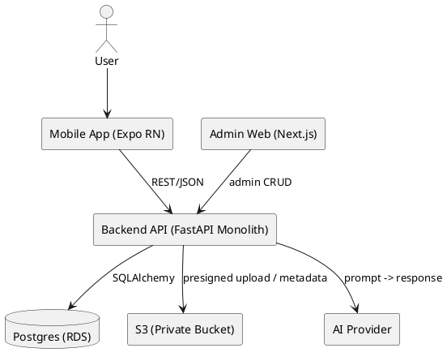

# SPEC-1-Home Building Companion App – Architecture (MVP)

## Background
The app helps a private home builder navigate the stages of building a house with **short, clear guidance per stage**, a **checklist of inspections**, **common mistakes**, and **what must be documented** (photos/notes/status). It also includes a **text-only AI assistant** for simple explanations and short Q&A (no image analysis, no construction instructions).

## Requirements
### Must
- Mobile app with a **single-stage scroll screen**: short explanation, checklist, common mistakes, what to document, photo uploads, notes.
- “Project/House” as a digital folder: store photos, notes, and checklist status per stage.
- AI: simple language explanation + project/stage context + “expand on request” + short answers (text only).
- Secure sign-up/sign-in.

### Should
- Basic Web Admin (CMS) to manage stages, checklists, and templates.
- Share project as read-only via link/code (optional for MVP).

### Could
- Realtime sync across devices.

### Won’t (MVP)
- Image analysis, smart alerts, engineering calculations, replacing a site supervisor.

## Method

### Recommended Stack (Python-first)
**Mobile Frontend:** React Native with Expo (EAS build/deploy).

**Backend (Monolith, Python):** FastAPI as a single API that owns all access to data, storage, and AI.
- ORM: SQLAlchemy 2.x (Async recommended)
- Migrations: Alembic

**Database:** PostgreSQL
- AWS: Amazon RDS for PostgreSQL (Multi-AZ for production)

**Object Storage (Photos):** Amazon S3 private bucket
- Upload/download via **presigned URLs** issued by the API
- Optional: CloudFront for faster delivery + signed URLs

**Auth:**
- Simplest: First-party JWT + refresh tokens
- More “AWS-native”: Cognito User Pools (JWT validation via JWKS)

**AI:** API endpoint `/ai/ask` (server-side keys, guardrails, rate limiting, logging)

**Admin Web (Should):** Next.js admin panel (CRUD for stages/checklists), protected by admin role.

### High-Level Architecture


### AWS Deployment (Monolith)
**Compute:** ECS Fargate behind an ALB
- Auto Scaling based on CPU/requests

**Networking:** VPC
- Public subnets: ALB only
- Private subnets: ECS tasks + RDS

**Secrets & Config:** AWS Secrets Manager (DB creds, AI keys) + SSM Parameter Store (non-secrets)

**Observability:** CloudWatch Logs + Metrics; ALB access logs to S3

### Database Schema (MVP-ready)
> Note: `users` are managed by your auth system (JWT/Cognito). We store only your user_id references.

**projects**
- id (uuid, pk)
- owner_user_id (text/uuid)
- name (text)
- location_text (text, nullable)
- created_at (timestamptz)

**stages** (content catalog)
- id (uuid, pk)
- slug (text, unique)
- title (text)
- short_explanation (text)
- common_mistakes (text)
- must_document (text)
- order_index (int)

**stage_check_items**
- id (uuid, pk)
- stage_id (uuid, fk -> stages)
- title (text)
- description (text, nullable)
- order_index (int)

**project_stage_status**
- id (uuid, pk)
- project_id (uuid, fk -> projects)
- stage_id (uuid, fk -> stages)
- status (text) // not_started | in_progress | done
- updated_at (timestamptz)

**project_check_results**
- id (uuid, pk)
- project_id (uuid, fk)
- check_item_id (uuid, fk)
- is_done (bool)
- note (text, nullable)
- updated_at (timestamptz)

**project_notes**
- id (uuid, pk)
- project_id (uuid, fk)
- stage_id (uuid, fk, nullable)
- body (text)
- created_at (timestamptz)

**project_media**
- id (uuid, pk)
- project_id (uuid, fk)
- stage_id (uuid, fk, nullable)
- storage_path (text)
- caption (text, nullable)
- taken_at (timestamptz, nullable)
- created_at (timestamptz)

**ai_conversations** (optional)
- id (uuid, pk)
- project_id (uuid, fk)
- stage_id (uuid, fk, nullable)
- user_id (text/uuid)
- user_message (text)
- ai_answer (text)
- created_at (timestamptz)

**Indexes (recommended)**
- projects(owner_user_id)
- stages(order_index)
- stage_check_items(stage_id, order_index)
- UNIQUE(project_check_results.project_id, project_check_results.check_item_id)

### AI Algorithm (MVP)
1. Client sends: question + project_id + optional stage_id.
2. API loads relevant project + stage content + checklist + current statuses.
3. Build prompt with strict rules:
   - Simple language, short bullet points
   - No construction instructions, measurements, or engineering specs
   - No image analysis
   - If safety/structural/engineering guidance is requested → advise consulting a professional
4. Return response.

## Cursor Playbook (Step-by-step build instructions)
Paste this into Cursor as the execution plan. Work strictly in order. Small commits.

### Clean Architecture Rules (non-negotiable)
- Layers:
  - **Domain**: pure business rules/entities/value objects (no FastAPI/DB/AWS imports).
  - **Application**: use-cases/services, DTOs, orchestration.
  - **Adapters/Interfaces**: web controllers/routers, repository interfaces, presenters.
  - **Infrastructure**: SQLAlchemy models, Alembic, S3 client, Cognito/JWT verifier, external integrations.
- Dependency direction: Web/Infra depend on Application/Domain only.
- All I/O (DB, S3, AI) behind interfaces + adapters.
- Test Domain/Application before integration.

### Required Repo Structure
- `apps/api/`
  - `app/domain/`
  - `app/application/`
  - `app/adapters/`
  - `app/infrastructure/`
  - `app/web/` (FastAPI)
- `apps/mobile/` (Expo RN)
- `apps/admin/` (Next.js, optional)
- `infra/` (Terraform or CDK)

### Stage 0 — Bootstrap
1. Create the repo structure above.
2. Add lint/format:
   - Python: ruff + black + mypy
   - TS: eslint + prettier
3. Add CI: lint + tests.

### DevOps (AWS) — Stage 1
Goal: a working Dev environment end-to-end.
1. Terraform/CDK:
   - VPC (public ALB, private ECS/RDS)
   - ECR repo
   - ECS Fargate service + task definition
   - ALB + HTTPS listener (placeholder cert ok for dev)
   - RDS Postgres (dev single-AZ)
   - S3 private bucket
   - IAM task role permissions: S3 presign + SecretsManager read
   - CloudWatch log group
2. GitHub Actions: build image → push to ECR → deploy ECS.
3. Document required env vars: `DATABASE_URL`, `AWS_REGION`, `S3_BUCKET`, `JWT_*`/`COGNITO_*`, `AI_PROVIDER_KEY`.

### Data (DB) — Stage 2
Goal: schema + migrations + seed.
1. Set up Alembic.
2. Implement tables listed above.
3. Add indexes/constraints as listed.
4. Add a seed script for `stages` + `stage_check_items` (start with 3 stages).
5. Add an integration test that starts Postgres (docker) and runs migrations.

### Backend (FastAPI) — Stage 3
Goal: clean-architecture API.
1. Domain:
   - Entities: Project, Stage, CheckItem, Note, Media, StageStatus, CheckResult.
2. Application:
   - Use-cases:
     - CreateProject, ListProjects
     - ListStages
     - GetProjectStageView (content + statuses)
     - UpdateCheckResult
     - AddNote
     - CreatePresignedUpload
     - AskAI (with guardrails)
   - Define repository interfaces (ports): ProjectRepo, StageRepo, MediaRepo, NotesRepo.
3. Infrastructure:
   - SQLAlchemy models + repo implementations
   - S3 adapter (boto3) for presigned URLs
   - Auth adapter:
     - Dev: first-party JWT
     - Prod: Cognito JWT verifier (JWKS)
4. Web:
   - Thin routers mapping HTTP → use-cases
   - Pydantic validation
   - Clean OpenAPI tagging
5. Security:
   - Authorization by `owner_user_id` on every query
   - Rate limit `/ai/ask`
   - Logging without excessive PII
6. Tests:
   - Unit tests for use-cases with fakes
   - Integration tests for repositories

### Frontend Mobile (Expo RN) — Stage 4
Goal: MVP screens.
1. Screens:
   - Auth
   - Projects list + create
   - Stage list (order_index)
   - Stage detail (scroll): explanation, checklist, mistakes, must-document
   - Notes
   - Media upload via presigned URL
   - Small AI chat (text only) inside stage screen
2. Data layer:
   - API client
   - State: Zustand or RTK Query (choose one)
3. UX:
   - Clear status indicators; “mark done” actions.

### Frontend Admin (Next.js) — Stage 5 (Optional)
- CRUD for `stages` and `stage_check_items` via API
- Admin role only

### Definition of Done for Every Stage
- CI is green
- Migrations run cleanly
- Short README update
- Manual demo: create project → view stage → checklist → photo → AI

## Implementation

### API Dockerfile (Production, multi-stage)
**`apps/api/Dockerfile`**
```dockerfile
# syntax=docker/dockerfile:1
FROM python:3.13-slim AS base
ENV PYTHONDONTWRITEBYTECODE=1 \
    PYTHONUNBUFFERED=1
WORKDIR /app

# system deps (psycopg)
RUN apt-get update && apt-get install -y --no-install-recommends \
    build-essential gcc \
 && rm -rf /var/lib/apt/lists/*

FROM base AS deps
COPY apps/api/pyproject.toml apps/api/poetry.lock* /app/
RUN pip install --no-cache-dir poetry \
 && poetry config virtualenvs.create false \
 && poetry install --only main --no-interaction --no-ansi

FROM base AS runtime
COPY --from=deps /usr/local /usr/local
COPY apps/api /app
EXPOSE 8000
CMD ["gunicorn", "app.main:app", "-k", "uvicorn.workers.UvicornWorker", "--bind", "0.0.0.0:8000", "--workers", "2", "--timeout", "60"]
```

### Local Dev (docker-compose)
**`docker-compose.yml`**
```yaml
services:
  db:
    image: postgres:16
    environment:
      POSTGRES_USER: app
      POSTGRES_PASSWORD: app
      POSTGRES_DB: app
    ports:
      - "5432:5432"
    volumes:
      - pgdata:/var/lib/postgresql/data

  api:
    build:
      context: .
      dockerfile: apps/api/Dockerfile
    environment:
      DATABASE_URL: postgresql+psycopg://app:app@db:5432/app
      S3_BUCKET: your-bucket
      AWS_REGION: eu-west-1
      AI_PROVIDER_KEY: change-me
    ports:
      - "8000:8000"
    depends_on:
      - db

volumes:
  pgdata:
```

### Minimal API Endpoints
- `POST /auth/login` / `POST /auth/register` (or Cognito integration)
- `GET /projects` `POST /projects`
- `GET /stages`
- `GET /projects/{id}/stages/{stage_id}`
- `PATCH /projects/{id}/checks/{check_item_id}`
- `POST /projects/{id}/notes`
- `POST /projects/{id}/media/presign`
- `POST /ai/ask`

### AWS Deploy Steps (ECS Fargate)
1. Create ECR repository.
2. Build & push Docker image via CI.
3. ECS cluster + task definition + service.
4. ALB listener (HTTPS) + target group.
5. RDS Postgres in private subnets.
6. S3 private bucket + IAM permissions for presign.
7. Inject secrets from Secrets Manager.
8. CloudWatch logs + alarms.

## Milestones
- M1: AWS infra + API skeleton + DB migrations + healthcheck
- M2: Stages/checklist read flow + project creation
- M3: Notes + media presigned upload + status updates
- M4: AI endpoint with guardrails + basic conversation logging
- M5 (Should): Admin panel for content management

## Gathering Results
- Adoption: % projects with ≥X photos/notes; % checklist items completed.
- Value: quick survey “Did this stage help you know what to inspect?”
- AI quality: thumbs up/down, escalation rate to a professional (ensuring safe boundaries).

## Need Professional Help in Developing Your Architecture?
Please contact me at [sammuti.com](https://sammuti.com) :)
